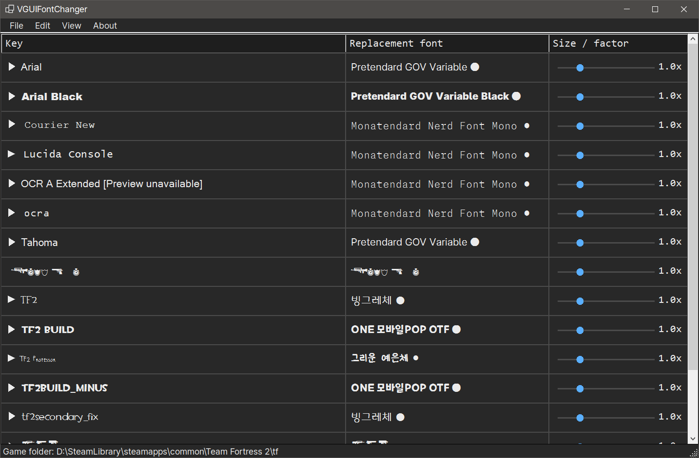

# VGUIFontChanger

  

A VGUI2 font replacement script for Source-engine games.

Built entirely using Codex and GLM. The repository owner, kawalain, claims no
ownership of the generated source code and takes no responsibility for it, so
review the code before you use or run it. It has been tested, but slop is slop,
what can you do ¯\\_(ツ)_/¯

## Run

~~~powershell
irm vfc.vmm.pw | iex
~~~

To install a specific version instead of the latest release:

~~~powershell
irm vfc.vmm.pw/0.2.0 | iex
~~~

## Usage

1. Run the script and pick a game to scan.
2. Choose a font family or adjust sizes in the list. The
   [TF2 alias map](docs/VGUI-ALIASES-TF2.md) documents which alias is used by
   which interface.
3. Apply. The override is written to the game's `custom/!VGUIFontChanger` mod.
4. Uninstall anytime. The generated mod is removed and the game falls back to
   its original fonts.

## FAQ

Q. Will this break my game?

> No. Game and mod files are never touched. Deleting the `!VGUIFontChanger`
> folder from `custom` reverts everything at any time.

Q. Does one apply last forever?

> No. If you install or update a mod that touches the GUI (HUD), apply again.

Q. Is this project slop?

> Yes. 100% slop. But it was useful, right?

See [docs](docs) for the source-tree structure and findings about Source VGUI
fonts: [structure](docs/STRUCTURE.md), [VGUI notes](docs/VGUI-NOTES.md),
[font investigation](docs/FONT-INVESTIGATION.md),
[TF2 alias map](docs/VGUI-ALIASES-TF2.md).

## License

[WTFPL v2](LICENSE)
